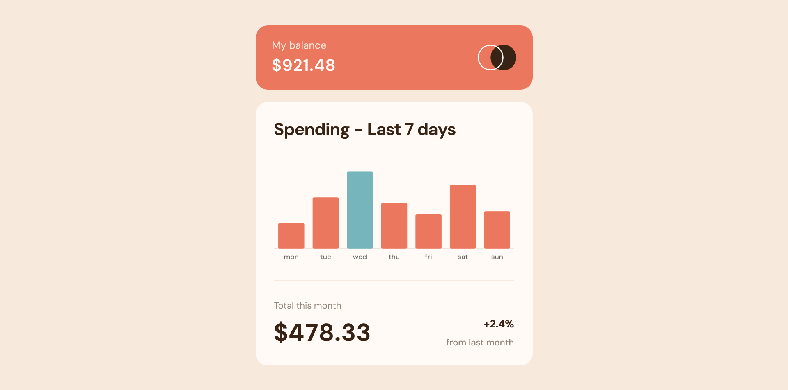

# Frontend Mentor - Expenses chart component

This is a solution to the [Expenses chart component challenge on Frontend Mentor](https://www.frontendmentor.io/challenges/expenses-chart-component-e7yJBUdjwt). Frontend Mentor challenges help you improve your coding skills by building realistic projects. 

## Table of contents

- [Overview](#overview)
  - [Screenshot](#screenshot)
  - [Links](#links)
- [My process](#my-process)
  - [Built with](#built-with)
- [Author](#author)
- [Acknowledgments](#acknowledgments)

## Overview

### The challenge

Users should be able to:

- View the bar chart and hover over the individual bars to see the correct amounts for each day
- See the current day’s bar highlighted in a different colour to the other bars
- View the optimal layout for the content depending on their device’s screen size
- See hover states for all interactive elements on the page
- **Bonus**: Use the JSON data file provided to dynamically size the bars on the chart

### Screenshot

### Links

- Solution URL: [Solution](https://www.frontendmentor.io/solutions/expenses-chart-component-built-with-chartjs-vYlJ6xiVvH)
- Live Site URL: [Live Site](https://danielmrz-dev.github.io/expenses-chart-component/)

## My process

### Built with

- Semantic HTML5 markup
- SASS
- Flexbox
- Grid
- Chart.js
- Mobile-first workflow
- JavaScript

## Author

- Frontend Mentor - [@danielmrz-dev](https://www.frontendmentor.io/profile/danielmrz-dev)
- Twitter - [@danielmrz_dev](https://www.twitter.com/danielmrz_dev)
